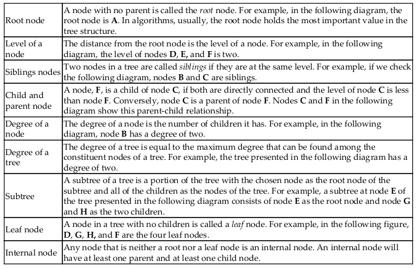
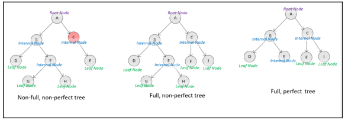

[](https://godoc.org/github.com/emirpasic/gods)

The management of data is one of the most important considerations to bear in mind while designing
any application. The purpose of any application is to get some data as input, process or operate
on in, and then provide suitable data as output.

## Mix of ds and algorithms 
This repo pretend understand and fun with datastructures and algorithms.

We will look at how we can use these data structures to create more sophisticated data structures, such as stacks, queues,
and trees, which are needed to develop complex algorithms.

### Data Structures Used in algorithms
Algorithms need necessary in-memory data structures that can hold temporary data while executing. Choosing the right data
structures is essential for their efficient implementation. Certain classes of algorithms are recursive or iterative in
logic and need data structures that ase specially designed for them.
For example, a recursive algorithm may be more easily implemented, exhibiting better performance, if nested data structures are used. 

#### Common data structures
  * Lists: Ordered mutable sequences of elements 
  * Tuples: Ordered inmmutable sequence of elements 
  * Sets: Unordered bags of elements 
  * Dictionary: Unordered bags of key-values pairs 
  * Data frames: Two-dimensional structures to store two dimensional data 

#### Big O notation
Is a mathematical notation that describes the limiting behavior of a function and we can 
classify algorithms according to how their run time or space requirements grow as the 
input size grows.

#### The time complexity of lists 
The time complexity of various functions of a list can be summarized as follows using the 
Big O notation:

| Different methods                 | Time complexity  |
| :-------------------------------: | :--------------: | 
| Insert an element                 | O(1)             | 
| Delete an elment                  | O(n)(as in the worst case may have to iterate the whole list)  | 
| Slicing a list                    | O(n)  | 
| Element retrieval                | O(n)  | 
| Copy                               | O(n)  | 

#### DataFrames
Is a data structure used to store tabular data available in Python's `pandas`
package or in onther languages like R or Apache spark. It is one of the most 
important data structures for algorithms and is used to process traditional structured data.

|id   |  name  |  age |  decision  |
|:---:|:------:|:----:|:----------:|
|1    |fares   |32    |True        |
|2    |Elena   |18    |False       |
|3    |Steven  |40    |False       | 

```python
>>> import pandas as pd
>>> df = pd.DataFrame([
...  ['1', 'Fares', 32, True],
...  ['2', 'Elena', 23, False],
...  ['3', 'Steven', 40, True]])
>>> df.columns = ['id', 'name', 'age', 'decision']
>>> df
```

### Terminologies of DataFrames
Let's look into some of the terminologies that are used in the context of a DataFrame:
 * Axis: In the pandas documentation, a single column or row of a DataFrame is called an axis.
 * Axes: If there is more than one axis, they are called axes as a group
 * Label: A DataFrame allows the naming of both columns and rows with what's called a label

#### Creating a subset of a DataFrame
Fundamentally, there are two main ways of creating the subset of a DataFrame:
 * Column selection
 * Row selection
##### Column Selection
In machine learning algorithms, selecting the right set of features is an important
task. We can select through position or specifying a filter 
```python
>>> df[['name','age']]
# A column can be retrieved by its position as follows 
>>> df.iloc[:,3]
>>> df.iloc[0:2,:]
```
To create a subset using a filter, we need to use one or more colums to define 
the selection criterion.
```python
>>> df[df.age>30]

>>> df[(df.age < 35)&(df.decision==True)]
```

### Stacks
A stack is a linear data structure to store a one-dimensional list. And store 
in `Last-In, First-Out(LIFO)`. The time complexity in the 4 elements is: O(1)
[implementation](python/stack.py)

### Queues
The elements are added and removed in `FIFO` format.
[implementation](python/queue.py)

### Tree
A tree is one of the mos useful data structures due to its hierarchical data storage
capabilities. While designing algorithms, we use trees wherever we need to represent
hierarchical relationships among the data elements that we need to store or process.

Each tree has a finite set of nodes so that it has a starting data element called 
`root` and a set of nodes joined together by links called `branches`.

#### Terminology


#### Types of trees
  * Binary tree: If the degree of a tree is two, that tree is called binary tree. 
  * Full tree: Is the one in which all of the nodes are of the same degree, which
  will be equal to the degree of the tree.
  * Perfect tree: Is a full tree in which all the leaf nodes are the same level.
  * Ordered tree: If the children of a node are organized in some order according
  to particular criteria, the tree is called an ordered tree. For example can be ordered
  left to right in an ascending order in which the nodes at the same level will increase



## Sorting and searching algorithms
This is an important class of algorithms and depending of many aspects as the amount
of data there are some better approaches than others. The following are types of
sorting algorithms:
 * Bubble sort
 * Merge sort
 * Insertion sort
 * Shell sort
 * Selection sort

### Bubble Sort 
Is the simplest and slowest algorithm used for sorting. It is designed in a way
that the highest value in its list bubbles its way to the top as the algorithm
loops through iterations. As it worst-case performance is O(N^2), it should be
used for smaller datasets.


